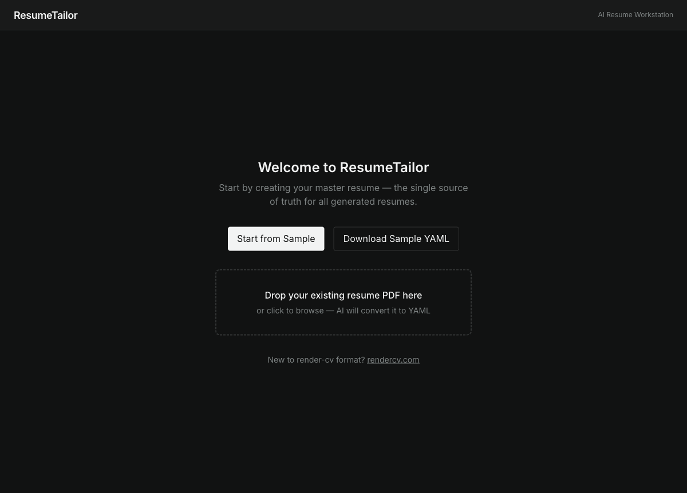
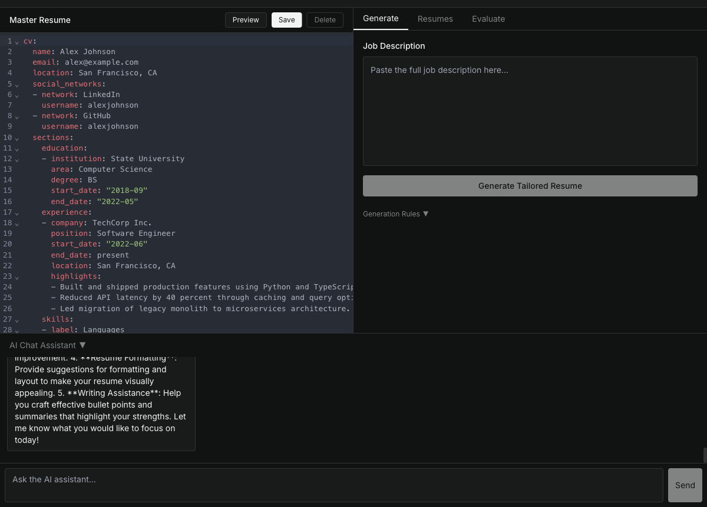
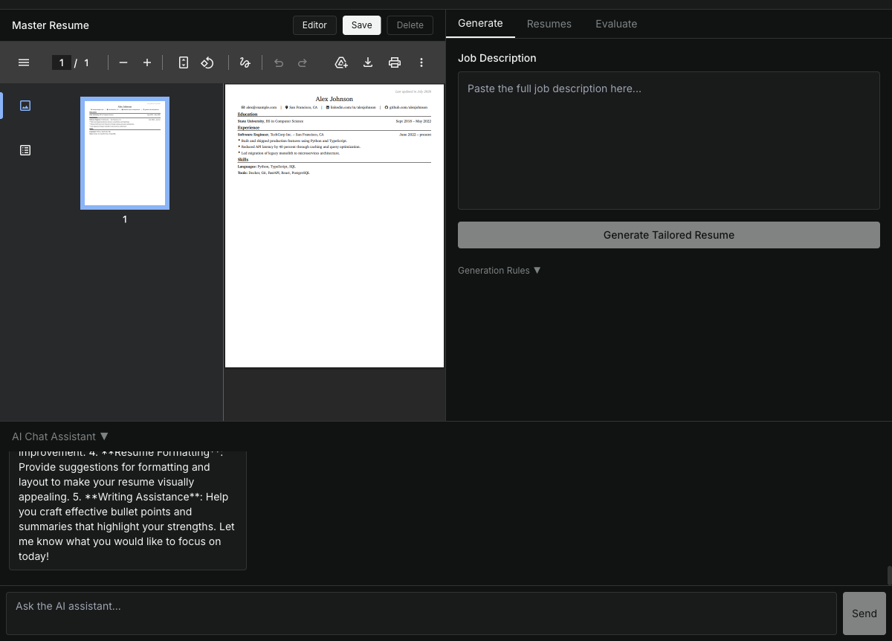
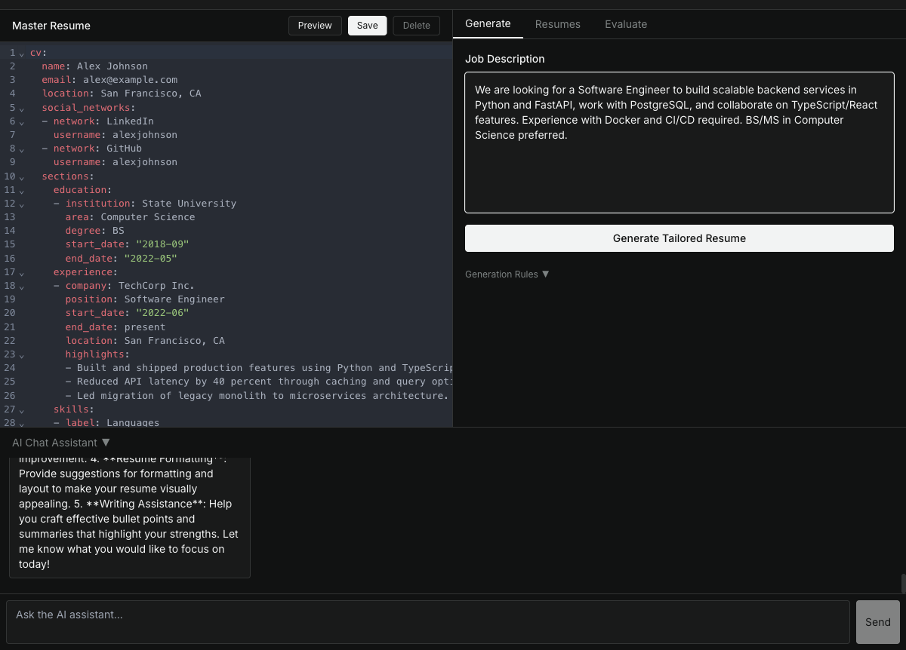
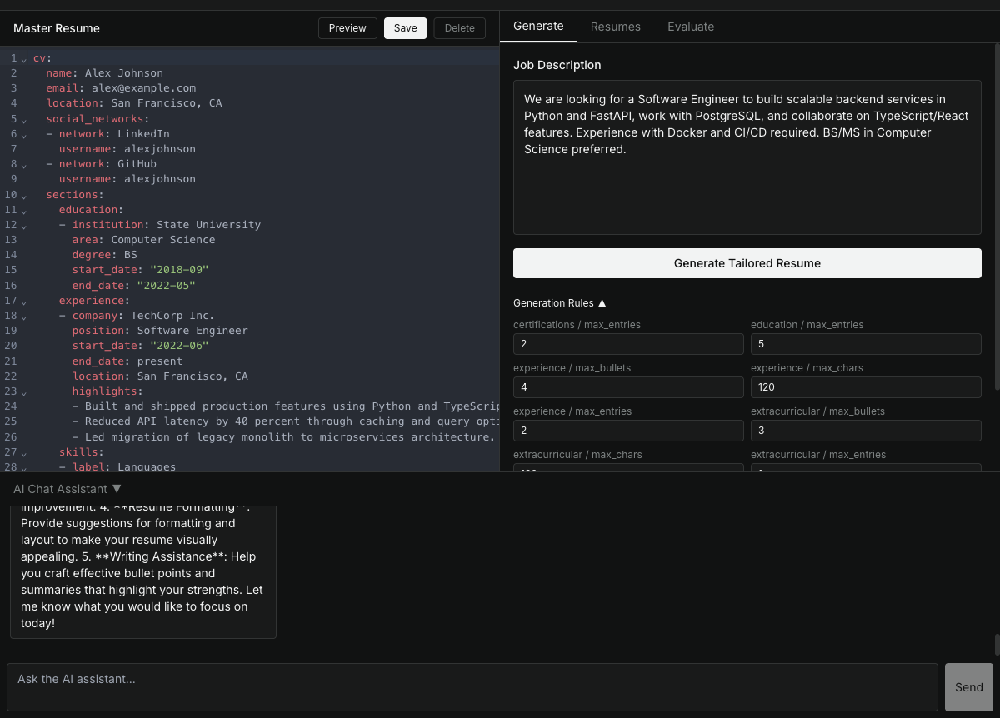
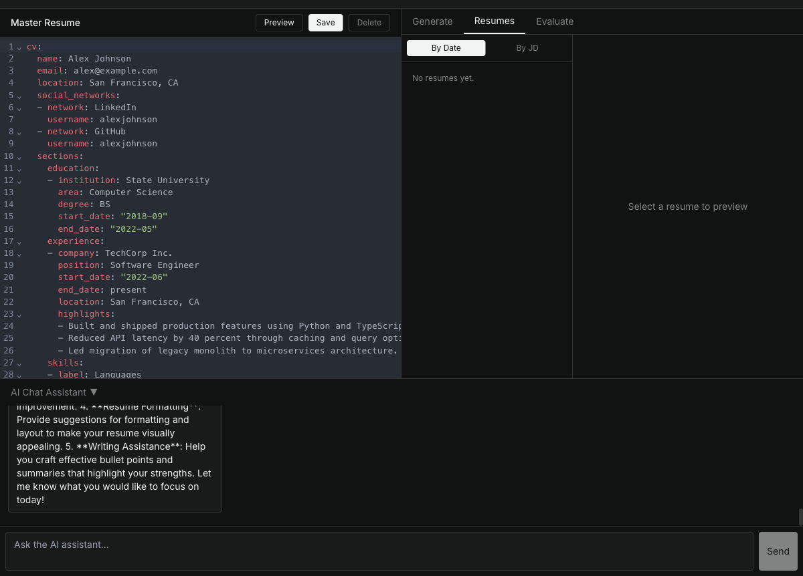
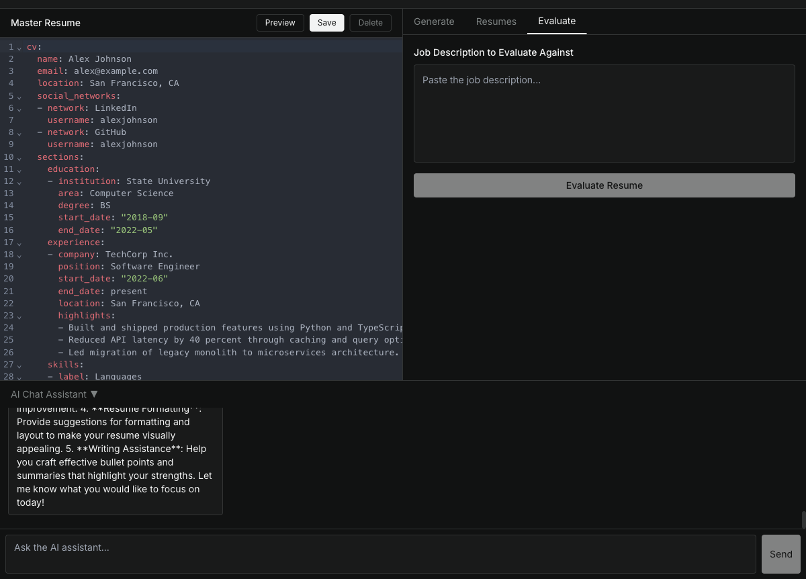

# ResumeTailor

An AI-powered resume workstation. Keep one **master resume** in YAML and let the AI generate job-specific tailored versions, evaluate your fit against any job description, and chat with an assistant to refine your content — all in a single-page app backed by a single Docker container.

---

## Screenshots

| Welcome | YAML Editor |
|---|---|
|  |  |

| PDF Preview | Generate with Job Description |
|---|---|
|  |  |

| Generation Rules | Resumes Library |
|---|---|
|  |  |

| ATS Evaluation | AI Chat Assistant |
|---|---|
|  |  |

---

## Features

**Master Resume Editor**
Write your complete career history once in [rendercv](https://rendercv.com) YAML format with full syntax highlighting. Preview the rendered PDF inline at any time. Import an existing PDF resume and the AI automatically converts it to YAML.

**Tailored Resume Generation**
Paste a job description and the AI selects and rewrites the most relevant sections from your master resume. Generation streams in real time via SSE. The result is immediately rendered to a downloadable PDF.

**Generation Rules**
Fine-tune generation behavior with numeric rules (max bullets per section, max chars per entry, etc.) without touching prompts. Rules persist across sessions.

**ATS Evaluation**
Paste any job description to get an ATS keyword match score, a list of matched and missing keywords, and a plain-English critique of your resume's fit.

**Resumes Library**
Every generated resume is saved and sortable by date or job description keyword. Click any to view or re-download the PDF.

**AI Chat Assistant**
A context-aware chat panel at the bottom of the workstation. Ask it to rewrite a section, add a bullet, or restructure the YAML — changes are applied directly to your master resume.

---

## Tech Stack

| Layer | Technology |
|---|---|
| Frontend | Next.js 14 (static export), React 18, TypeScript, Tailwind CSS, CodeMirror 6 |
| Backend | Python, FastAPI, uvicorn, LiteLLM (OpenAI-compatible) |
| PDF rendering | [rendercv](https://rendercv.com) via Typst — no LaTeX required |
| Database | SQLite |
| Deployment | Single Docker container (frontend static files served by FastAPI) |

---

## Quick Start

```bash
# 1. Clone and configure
git clone https://github.com/your-username/resume-tailoring-platform.git
cd resume-tailoring-platform
cp .env.example .env
# edit .env and set OPENAI_API_KEY=sk-...

# 2. Build and run
docker compose up --build

# 3. Open
open http://localhost:8000
```

That's it — one container serves the full app.

---

## Development Setup

Run frontend and backend separately for hot reload:

**Backend**
```bash
cd backend
uv sync
LLM_MOCK=true DB_PATH=/tmp/resumedb.db PDFS_DIR=/tmp/pdfs \
  uv run uvicorn app.main:app --reload --host 127.0.0.1 --port 8000
```

**Frontend**
```bash
cd frontend
npm install
npm run build          # produces frontend/out/
cp -r out ../backend/static
# then access via http://localhost:8000
```

> The frontend is a static export — API calls go to relative `/api/*` paths. In development, build the frontend and copy it into `backend/static/` so FastAPI serves both.

**Tests**
```bash
# Backend unit tests
cd backend && uv run pytest

# End-to-end tests (requires running app)
cd test && npx playwright test
```

---

## Configuration

Copy `.env.example` to `.env` and set:

| Variable | Default | Description |
|---|---|---|
| `OPENAI_API_KEY` | — | **Required.** Any OpenAI-compatible API key |
| `LLM_MODEL` | `gpt-4o-mini` | Model used for all AI tasks |
| `LLM_MOCK` | `false` | Set `true` for deterministic mock responses (testing) |
| `DB_PATH` | `/app/db/resumedb.db` | SQLite database path |
| `PDFS_DIR` | `/app/pdfs` | Directory for generated PDF files |

LiteLLM is used under the hood, so `OPENAI_API_KEY` works with any compatible provider — set `LLM_MODEL` to the appropriate model string for your provider.

---

## Architecture

```
┌─────────────────────────────────────────┐
│            Docker Container             │
│                                         │
│  FastAPI (port 8000)                    │
│  ├── /api/*        backend routes       │
│  └── /*            Next.js static files │
│                                         │
│  SQLite  ──  master resume              │
│              generated resumes          │
│              chat history               │
│              rules                      │
│                                         │
│  rendercv (Typst) ── PDF generation     │
│  LiteLLM ────────── LLM calls          │
└─────────────────────────────────────────┘
```

Generation and evaluation use **Server-Sent Events (SSE)** so progress streams to the UI in real time. The YAML normalizer (`backend/app/yaml_utils.py`) translates any LLM-generated YAML into valid rendercv schema before rendering.

---

## Resume Format

The master resume uses [rendercv](https://rendercv.com) YAML format. Click **Download Sample YAML** on the welcome screen for a starter template, or drag-and-drop an existing PDF to have the AI generate the YAML automatically.
